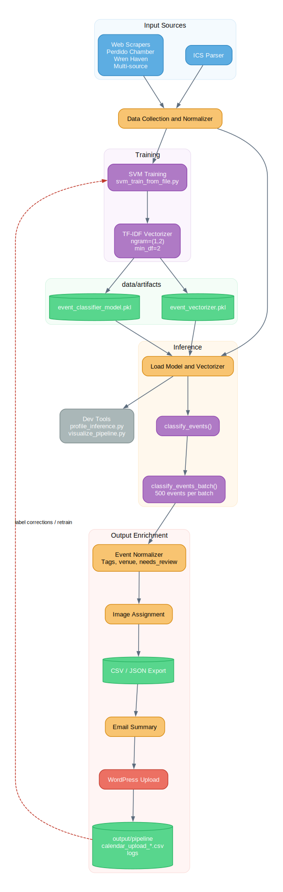
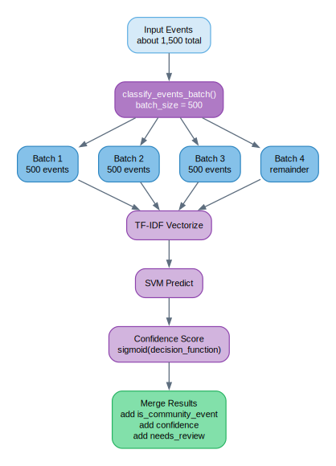
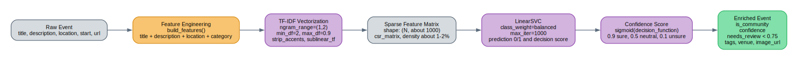
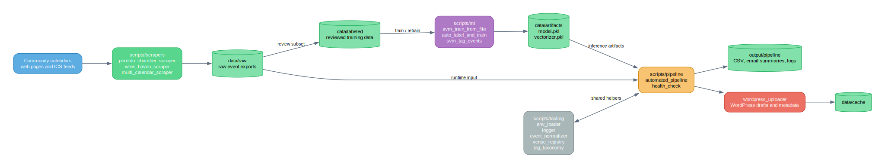
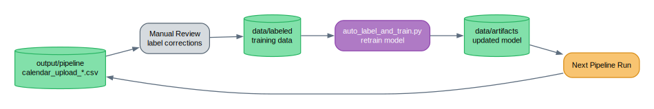

# ML Pipeline Architecture & Data Flow

> Viewing tip: Open this file in VS Code and press `Ctrl+Shift+V` to see the diagrams rendered in Markdown Preview.
>
> These diagrams are embedded SVG files, so they render even if Mermaid support is unavailable.

---

## 1. System Architecture

Source: [docs/diagrams/src/system_architecture.dot](/home/jacobmiller/EnvisionPerdido/docs/diagrams/src/system_architecture.dot)

---

## 2. Batch Classification Flow

Source: [docs/diagrams/src/batch_classification.dot](/home/jacobmiller/EnvisionPerdido/docs/diagrams/src/batch_classification.dot)

---

## 3. Data Transformation Pipeline

Source: [docs/diagrams/src/data_transformation.dot](/home/jacobmiller/EnvisionPerdido/docs/diagrams/src/data_transformation.dot)

---

## 4. Script and Data Flow

Source: [docs/diagrams/src/script_dependencies.dot](/home/jacobmiller/EnvisionPerdido/docs/diagrams/src/script_dependencies.dot)

---

## 5. Feedback Loop

Source: [docs/diagrams/src/feedback_loop.dot](/home/jacobmiller/EnvisionPerdido/docs/diagrams/src/feedback_loop.dot)
